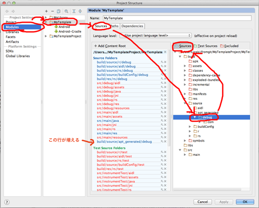

Android Studio(+gradle) 用のプロジェクトの雛形です。

環境変数 ANDROID_HOME に sdk のパスを設定した上で使用することを前提としています。

    export ANDROID_HOME=/Applications/Android\ Studio.app/sdk

Android Studio に取り込む際は、 File -> Import Project... から Gradle のプロジェクトとして取り込んでください。

その後、 apt で生成されたファイルを Android Studio から参照できるようにするため以下の設定を行なってください。
* MyTemplate プロジェクトを選択し、 File > Project Structure を開く
* Modules ＞ MyTemplate を選択し Sources タブを選んで build/source/apt_generated/debug を選択し、上にある Sourcesボタン を押して Sourceフォルダとする。



この雛形は Android Studio から自動生成されたファイルを含むので、その部分に関しては Android Studio のライセンスに従います。
私が修正した部分のライセンスは Apache License 2.0 とします。


事前に以下の準備をしておくこと。

* ActionBarSherlock をローカルの maven リポジトリにインストールしておく。手順は以下のとおり

適当なディレクトリに ActionBarSherlock を clone する(4.3.2 以降が必要だが、まだリリースされてないので dev ブランチを使用)。

    git clone git://github.com/JakeWharton/ActionBarSherlock.git -b dev

以下の様な修正をしてローカルリポジトリに入れて( gradle :actionbarsherlock:uploadArchives )使用している。SDK Manager で、 Android 4.0(API 14) をダウンロードしておく必要が有る。

```
diff --git a/actionbarsherlock/build.gradle b/actionbarsherlock/build.gradle
index 5b05162..c05924d 100644
--- a/actionbarsherlock/build.gradle
+++ b/actionbarsherlock/build.gradle
@@ -1,7 +1,7 @@
 apply plugin: 'android-library'

 dependencies {
-  compile 'com.google.android:support-v4:r7'
+  compile 'com.android.support:support-v4:13.0.0'
 }

 android {
@@ -16,3 +16,13 @@ android {
     }
   }
 }
+
+apply plugin: 'maven'
+
+uploadArchives {
+    repositories {
+        mavenDeployer {
+            repository(url: "file://$System.env.HOME/.m2/repository")
+        }
+    }
+}
diff --git a/build.gradle b/build.gradle
index daade24..03d1a0d 100644
--- a/build.gradle
+++ b/build.gradle
@@ -4,7 +4,7 @@ buildscript {
   }

   dependencies {
-    classpath 'com.android.tools.build:gradle:0.4'
+    classpath 'com.android.tools.build:gradle:0.4.3'
   }
 }
```
